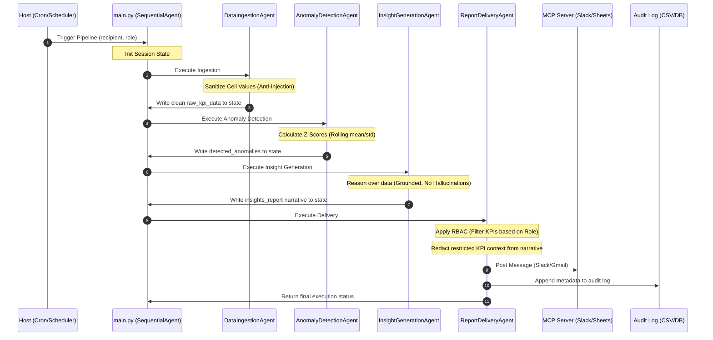

# PulseBoard Multi-Agent System Architecture

PulseBoard is a secure, multi-agent business intelligence pipeline designed to ingest KPI data, detect anomalies, generate executive-ready natural language insights, and deliver reports to configured Slack or Email channels while maintaining full auditability.

## Multi-Agent Execution Flow

The system orchestrates execution sequentially via Google's Agent Development Kit (ADK) `SequentialAgent` pipeline:

---

## Agent Definitions

### 1. DataIngestionAgent ([data_ingestion.py](file:///c:/Capstone%20Project/agents/data_ingestion.py))
- **Role**: Ingests KPI rows from spreadsheets/CSVs.
- **Inputs**: CSV file path (`csv_path` in session state).
- **Outputs**: Writes sanitized dataset to `session.state["raw_kpi_data"]`.
- **Design Decisions**: Performs strict data type validation and calls `sanitize_string` to strip suspicious characters, guarding the pipeline from downstream injection.

### 2. AnomalyDetectionAgent ([anomaly_detector.py](file:///c:/Capstone%20Project/agents/anomaly_detector.py))
- **Role**: Detects statistical deviations in historical metrics.
- **Inputs**: Read `session.state["raw_kpi_data"]`.
- **Outputs**: Writes anomaly records (Normal / Watch / Critical) to `session.state["detected_anomalies"]`.
- **Design Decisions**: Offloads calculations to the reusable `skills/anomaly_detection` module, utilizing rolling mean and standard deviation over $N$ periods.

### 3. InsightGenerationAgent ([insight_generator.py](file:///c:/Capstone%20Project/agents/insight_generator.py))
- **Role**: Converts statistical alerts into a narrative for human executives.
- **Inputs**: Reads `detected_anomalies` from session state.
- **Outputs**: Saves executive narrative to `session.state["insights_report"]`.
- **Design Decisions**: Implemented as a Google ADK `LlmAgent` using `gemini-2.5-flash`. The prompt enforces strict grounding rules (no numerical hallucinations, reasoning only on passed context).

### 4. ReportDeliveryAgent ([report_delivery.py](file:///c:/Capstone%20Project/agents/report_delivery.py))
- **Role**: Applies security checks, formats, and transmits reports.
- **Inputs**: Reads `insights_report` and `detected_anomalies` from session state.
- **Outputs**: Dispatches report to Slack/Gmail via MCP and writes a delivery trace log.
- **Design Decisions**: 
  - Checks role-based access list (`config/rbac.yaml`) and filters out unauthorized KPIs.
  - Sanitizes the natural language narrative, redacting sentences discussing unpermitted KPIs.
  - Dispatches message via `ClientSession` to a local or configured stdio MCP Server.

---

## Core Security Features

1. **No Hard-coded Secrets**: Environment variables are dynamically loaded using `python-dotenv`. Credentials and API tokens are never written to source control.
2. **Role-Based Access Control (RBAC)**: Recipient roles determine the subset of KPIs they can see. If a Team Lead receives a report, the `ReportDeliveryAgent` removes restricted metrics (e.g., `revenue`) from both the statistics table and the natural language insights text prior to dispatch.
3. **Anti-Injection Input Sanitization**: Pre-empts CSV/Formula injection by prefixing `=, +, -, @` characters in strings with `'`, and redacts prompt-injection command instructions (e.g. *"ignore prior instructions"*).
4. **Resiliency**: Critical external calls (e.g., to the MCP servers) are decorated with `tenacity` retry-with-exponential-backoff logic, handling transient socket timeouts and rate limit (HTTP 429) errors.
